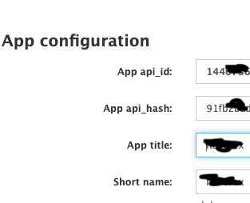
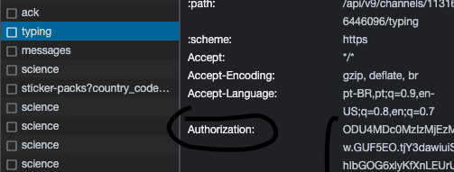

<p align="center">
  <a href="https://github.com/joaroque/Discord-to-Telegram">
    
  </a>
</p>
<h2 align="center">Messages forwarder in real time by Websockets</h2>
<p align="center">
    <a href="https://github.com/joaroque/Discord-to-Telegram/issues">Report Bug</a>
    ·
    <a href="https://github.com/joaroque/Discord-to-Telegram/issues">Request Feature</a>
</p>
<p align="center">
  <a href="https://github.com/joaroque/Discord-to-Telegram/fork" target="blank">
    
  </a>
  <a href="https://github.com/joaroque/Discord-to-Telegram/stargazers" target="blank">
    
  </a>
  <a href="https://github.com/joaroque/Discord-to-Telegram/issues" target="blank">
    
  </a>
  <a href="https://github.com/joaroque/Discord-to-Telegram/pulls" target="blank">
    
  </a>
</p>

## :arrow_down: Installation

To get a local copy installed and working, follow these steps:

- Clone this repository

  ```console
  git clone https://github.com/joaroque/Discord-to-Telegram.git
  ```

- Enter the project folder

  ```sh
  cd Discord-to-Telegram
  ```

### 📦 Install dependencies

1. Create a virtual env

  ```shell
    python3 -m venv venv
  ```

2. Active virtual env

3. Use `pip install -r requirements.txt` to install all dependencies.

### 🚀 Setup the bot

1. Get telegram client [credentials](https://my.telegram.org/auth), get the API_ID, API_HASH and CLIENT_NAME



2. Get discord auth token from discord requests


3. Setting up `.ini` file

   ```ini
    [TELEGRAM]
    API_ID =
    API_HASH =
    CLIENT_NAME =
    DEST_CHANNEL = -100123456789

    [DISCORD]
    SOURCE_CHANNEL =
    AUTH_TOKEN =

   ```

4. Start the bot

   ```shell
    python main.py
   ```

## Meta
Get discord [channel id](https://support.discord.com/hc/en-us/articles/206346498-Where-can-I-find-my-User-Server-Message-ID-)

Get Telegram [channel id](https://neliosoftware.com/content/help/how-do-i-get-the-channel-id-in-telegram/)

I made this banner using saviomartin's [Slickr](https://slickr.vercel.app/) tool.
